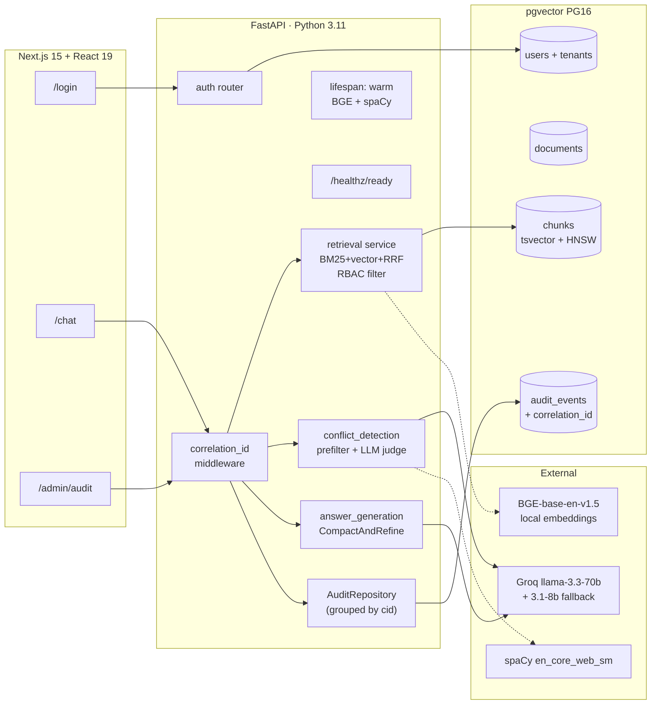

# HOLOCRON

> Classification-aware enterprise RAG over a synthetic Galactic Empire corpus.
> Two flagship demos: (1) **honest refusal** of out-of-clearance content with audit-traceable reference IDs, (2) **automatic side-by-side detection of contradictions** in retrieved sources.

A portfolio-grade enterprise RAG system demonstrating production AI-engineering practice: hybrid RBAC-filtered retrieval (BM25 + pgvector + RRF), heuristic-prefiltered LLM-as-judge conflict detection, grounded `[n]` citations via LlamaIndex `CompactAndRefine`, append-only audit with correlation IDs threaded through structlog, FastAPI lifespan warming with K8s-shaped `/healthz/ready`, and a hand-rolled eval harness with regression diffs.

See [docs/superpowers/specs/2026-06-27-holocron-design.md](docs/superpowers/specs/2026-06-27-holocron-design.md) for the full design rationale.

## Architecture



(Mermaid source: [docs/architecture/holocron-system.mmd](docs/architecture/holocron-system.mmd). GitHub renders the block above natively.)

## Quickstart

Prereqs: Docker Desktop, Python 3.11, pnpm 11, a Groq API key.

> **Port note:** Postgres is exposed on host **5433** (not 5432) so it doesn't collide with any Postgres already installed on the host.

```powershell
# 1. Services
docker compose up -d postgres redis

# 2. Backend (one-time)
make backend-install        # creates .venv and installs deps (~1.5 GB incl. PyTorch CPU)
cd backend
./.venv/Scripts/Activate.ps1
python -m spacy download en_core_web_sm    # one-time, ~50 MB
make -C .. backend-migrate
make -C .. backend-seed                    # copy tenant id from output
make -C .. seed-corpus                     # ~130s first run (BGE model download)

# 3. Frontend (one-time)
cd ../frontend
pnpm install
pnpm approve-builds --all
# Edit .env.local: NEXT_PUBLIC_DEFAULT_TENANT_ID=<tenant id from seed>

# 4. Set the Groq key (backend/.env or shell env)
$env:GROQ_API_KEY = "<your-groq-key>"

# 5. Run (two terminals)
# Terminal A:
cd backend
./.venv/Scripts/Activate.ps1
uvicorn app.main:app --reload --port 8000
# Wait ~50s — FastAPI lifespan warms BGE + spaCy before accepting requests.
# `GET http://localhost:8000/healthz/ready` returns 200 once warm.

# Terminal B:
cd frontend && pnpm dev
```

Open <http://localhost:3000>, log in with the tenant id and any seeded account below.

> **Dev tip:** set `HOLOCRON_SKIP_WARMUP=1` for the backend process to skip the 50s startup wait. The first `/chat/ask` after a skip will then pay the BGE + spaCy load cost itself.

## 60-second demo script

Log in to `/chat` and run these in order. Both demos reproduce the spec's flagship behaviors end-to-end.

**Demo A — HR / Employee Handbook (conflict + refusal)**

1. **`executive.procurement`** (Executive, has HR): ask *"What's the dress-code policy for off-base events?"*
   - **Expected:** answer cites both the public *Employee Handbook* and the restricted *Management Conduct Supplement*; a **conflict card** flags the 2019 vs 2023 disagreement on insignia / off-duty conduct.
2. Log out. Log in as **`employee.security`** (Employee, security dept only). Ask the same question.
   - **Expected:** answer cites only the public handbook; a **refusal notice** appears: *"N higher-clearance sources may also be relevant. Request access via Reference #…"*

**Demo B — Operations / Reactor (conflict + refusal)**

3. Log in as **`director.engineering`**. Ask *"What is the correct coolant shutdown sequence for the reactor?"*
   - **Expected:** answer cites the *Reactor Operations Manual* (both restricted, both engineering). When retrieval pulls both the 2019 and 2023 versions into top-k, a **conflict card** flags the procedural disagreement.
4. Log out. Log in as **`employee.security`**. Ask the same question.
   - **Expected:** **refusal notice** with reference ID (engineering content is out of dept).

**Audit walkthrough**

5. As `executive.fleet` or `director.engineering`, navigate to **`/admin/audit`**.
   - **Expected:** all four queries above appear as **separate correlation-grouped rows**. Each row expands to show its 2–3 underlying audit events: query text, retrieved chunk IDs, withheld chunk IDs + refusal reference, response text, conflict subjects, and latency.
   - Toggle the `Has refusal: yes` filter — only the two refusal rows remain. Toggle `Has conflict: yes` — only the conflict rows remain.

### Seeded demo accounts

All passwords: `imperial-march`.

| Username                | Role      | Departments               | Badge      |
|-------------------------|-----------|---------------------------|------------|
| employee.security       | Employee  | security                  | Public     |
| employee.engineering    | Employee  | engineering               | Public     |
| manager.hr              | Manager   | hr                        | Restricted |
| manager.engineering     | Manager   | engineering               | Restricted |
| director.engineering    | Director  | engineering               | Secret     |
| director.security       | Director  | security                  | Secret     |
| executive.fleet         | Executive | fleet_operations,security | Top Secret |
| executive.procurement   | Executive | procurement,hr            | Top Secret |

## Evaluation

```bash
make eval
```

Runs the 30-question golden set (12 lookup / 8 refusal / 6 conflict / 4 cross-department) against the live system on `:8000` and writes:

- `backend/eval/reports/YYYY-MM-DD.md` — markdown scorecard + diff vs previous run
- `backend/eval/reports/YYYY-MM-DD.json` — machine-readable sidecar

**Scoring axes** (per spec §7):

- **Retrieval hit-rate** — `must_cite_lineages` ⊆ retrieved lineages. Deterministic.
- **Refusal correctness** — `must_refuse` matches the response refusal payload, with optional `refusal_min_withheld` floor. Deterministic.
- **Conflict surfacing** — at least one returned conflict's `subject` substring-matches expected keywords. Deterministic.
- **Citation accuracy** — LLM-as-judge over `(question, answer, cited snippets)` returns a `score ∈ [0, 1]`. Single Groq call per question; results cached in `backend/eval/.cache/` (gitignored) to keep iteration cheap.

Eval is **local-only** by design; no CI. Rationale: portfolio project, no PR-racing team, and Groq quota is finite. See [docs/superpowers/specs/2026-06-28-phase-d-eval-audit-polish.md](docs/superpowers/specs/2026-06-28-phase-d-eval-audit-polish.md) §4 decision 3.

Prereqs to run: backend on `:8000` (warmed), corpus seeded, `GROQ_API_KEY` set, and `HOLOCRON_TENANT_ID` env var matching the value in `frontend/.env.local`.

## Tests

```bash
make backend-test          # default suite, ~180 tests, ~35s
cd backend && ./.venv/Scripts/python.exe -m pytest -m slow -v   # 4 opt-in slow tests
```

## Layout

- `backend/app/` — FastAPI + SQLAlchemy + Alembic + LlamaIndex + BGE + Groq + structlog
- `backend/eval/` — golden set, runner, scorer, report writer
- `frontend/app/` — Next.js App Router: `/login`, `/chat`, `/admin/audit`
- `corpus/` — 18 synthetic Imperial documents across HR, IT, Security, Engineering, Procurement, Fleet Ops
- `docs/architecture/` — mermaid source
- `docs/superpowers/` — specs & implementation plans (Phase A through D)

## Phase status

- Phase A — Foundation ✅
- Phase B — Ingestion + RBAC retrieval ✅
- Phase C — Conflict detection + chat UI ✅
- Phase D — Eval, audit, polish ✅

Post-MVP roadmap (Phase 2 / Phase 3): see design spec §10.5 / §10.6.
